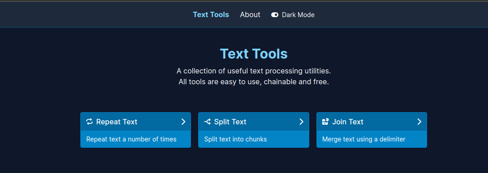
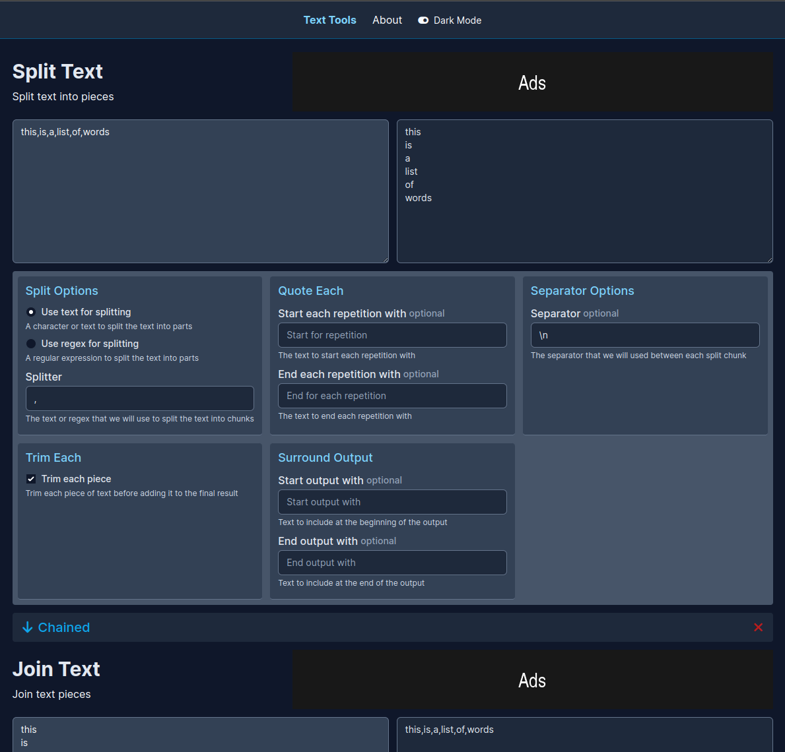
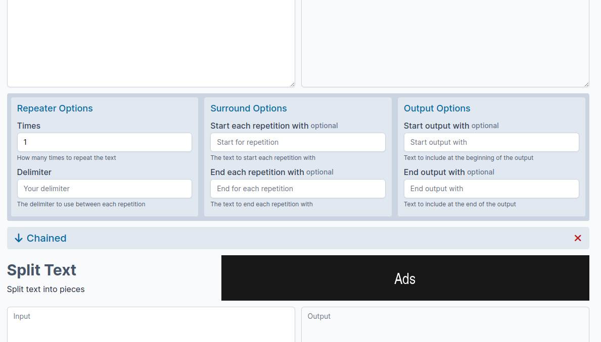

# Text Tools

Another unfinished POC side project for a text tools site,
mainly to create a project structure capable of serving multiple niche sites using the same code base.

## Text Tools

An implementation of a chainable set of text tools implemented with TypeScript and React.

In Dark Mode:

In Light Mode:

## Requirements

Fontawesome is needed for the icons at `sites/src/assets/fontawesome`.
